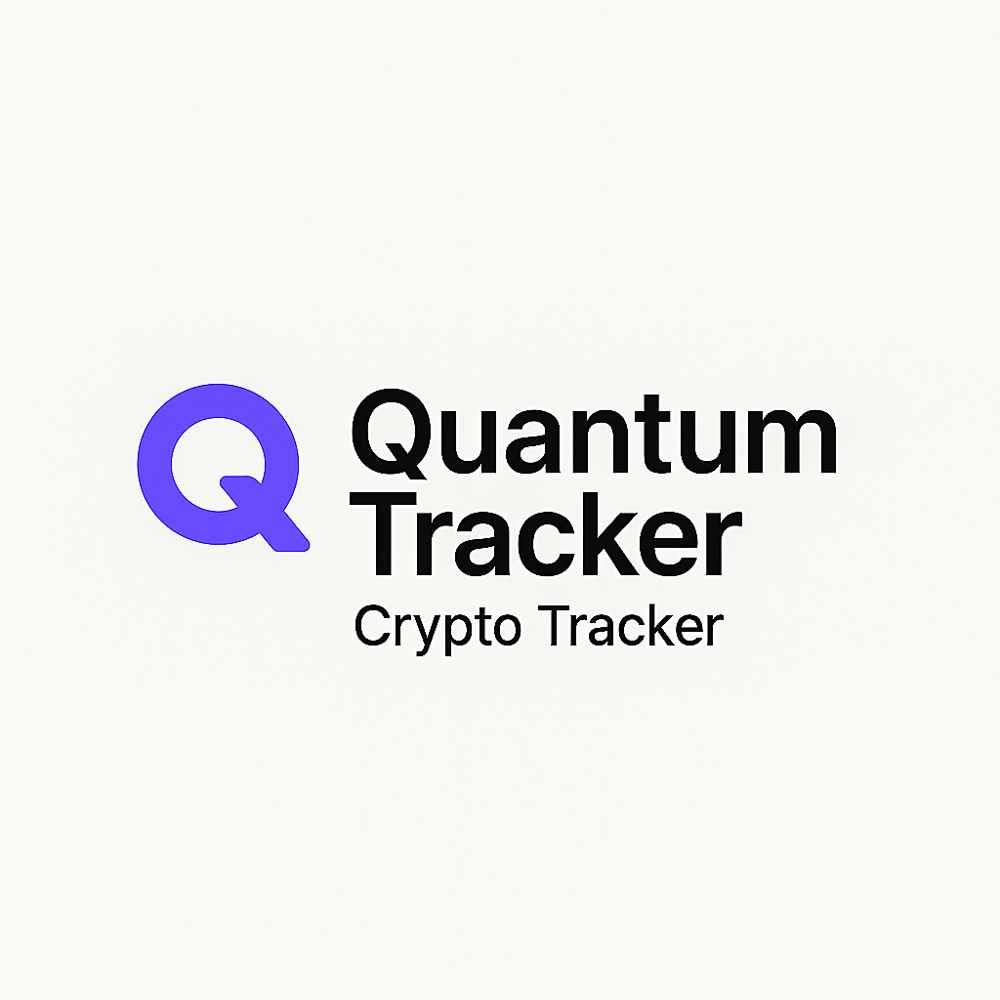

# 🚀 Quantum Crypto Tracker — Your Real-Time Window into Digital Assets



**Quantum Crypto Tracker** is a visually engaging, real-time cryptocurrency tracker built with **Flask**, leveraging the **CoinGecko API** for up-to-the-minute crypto data. Designed with a sleek dark UI, animations, and glassmorphism effects, it offers both crypto enthusiasts and casual users an intuitive way to explore the crypto market.

---

## 🌐 Live Demo

👉 [**View Live Demo**](https://quantum-tracker-lyart.vercel.app/)

---

## 🔥 Features

- 📊 **Real-Time Crypto Data**: Track current prices, market cap, and 24-hour changes for top 100 coins.
- 🎨 **Modern UI Design**: Dark theme with glassmorphism, gradients, and soft shadows.
- 🌀 **Animated Experience**: Smooth transitions and loading effects for an engaging UX.
- 🔍 **Search Functionality**: Instantly find any cryptocurrency by its ID (e.g., `bitcoin`, `dogecoin`).
- 📈 **Detailed Coin View**:
  - Symbol, name, rank, price stats, supply info
  - 7-day price chart using Chart.js
  - Coin description and all-time highs
- 📱 **Responsive Layout**: Mobile, tablet, and desktop optimized.
- 📌 **Fixed Footer**: Persistent footer with contact links.
- ❌ **Custom 404 Page**: Beautifully styled page for invalid routes.

---

## 🧠 How it Works

- The homepage fetches data from CoinGecko `/coins/markets`.
- Search allows users to jump to individual coin views via `/coins/{id}`.
- Coin details page fetches and visualizes price and metadata using Chart.js.
- Handles missing or invalid coin IDs gracefully with a custom 404 page.

---

## 🛠️ Tech Stack

- **Backend**: Flask (Python)
- **Frontend**: HTML, CSS, JavaScript
- **Charts**: Chart.js
- **API**: CoinGecko (no auth required)
- **Design**: Dark UI, responsive layout, animations

---

## 📁 Project Structure

```
QuantumTracker/
├── app.py                  # Flask backend application
├── requirements.txt        # Python dependencies
├── vercel.json             # Vercel deployment configuration
├── templates/
│   ├── index.html          # Main cryptocurrency list page
│   ├── coin_details.html   # Detailed coin information page
│   └── 404.html            # Custom 404 error page
├── static/
│   ├── css/
│   │   └── style.css       # Global styles and animations
│   └── js/
│       ├── script.js       # Logic for main page (fetching, search)
│       └── coin_details.js # Logic for coin detail charts
└── assets/
    ├── cover_image.png     # Cover image for README and metadata
    ├── screenshot_1.png    # Screenshot of homepage
    ├── screenshot_2.png    # Screenshot of coin detail page
    └── screenshot_3.png    # Screenshot of coin chart/extra view


```

---

## 🚀 Getting Started

```bash
git clone https://github.com/QuantumTracker.git
cd QuantumTracker
python -m venv venv
source venv/bin/activate  # or .\venv\Scripts\activate on Windows
pip install -r requirements.txt
python app.py
```

Visit: [http://127.0.0.1:5000](http://127.0.0.1:5000)

---

## 📸 Screenshots

| Home Page | Coin Detail | Chart View |
|-----------|-------------|------------|
|  |  |  |

---

## 🙋‍♂️ Author

**Faisal Khan**

- 🌐 [Portfolio](https://khanfaisal.netlify.app)
- 💻 [GitHub](https://github.com/khanfaisal79960)
- 🔗 [LinkedIn](https://www.linkedin.com/in/khanfaisal79960)
- ✍️ [Medium](https://medium.com/@khanfaisal79960)
- 📷 [Instagram](https://instagram.com/mr._perfect_1004)

---
