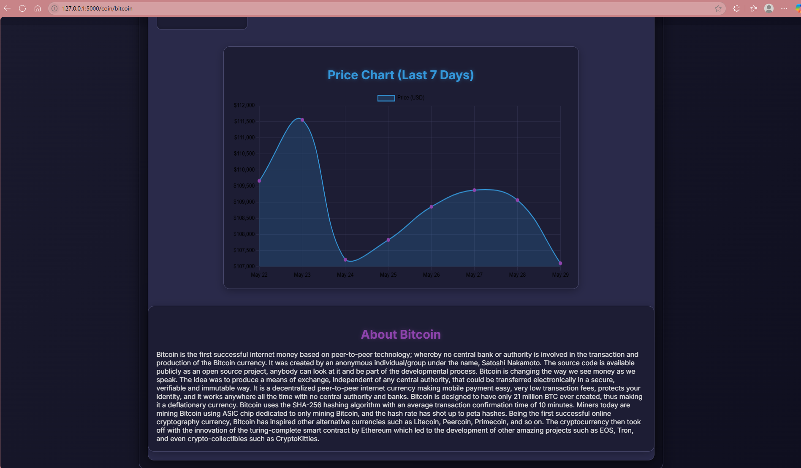

# Quantum Crypto Tracker 🚀💹

**"Your real-time window into the digital asset world."**

**Quantum Crypto Tracker** is a modern, visually appealing web application built with **Flask (Python)** and a responsive frontend using **HTML, CSS, and JavaScript**. It allows users to track real-time cryptocurrency prices, market capitalization, 24-hour price changes, and view detailed information, including historical price charts for individual cryptocurrencies.

The application features a dark, cool aesthetic with subtle animations and a fixed footer to enhance user experience.

---

## 🌐 View Live Project

👉 [Quantum Crypto Tracker Live](https://quantum-crypto.vercel.app)

---

## ✨ Features

- **📊 Real-time Crypto Data:** Track current prices, market cap, and 24-hour price changes for the top 100 cryptocurrencies.
- **🎨 Visually Appealing Design:** Dark theme, vibrant gradients, rounded corners, subtle shadows, and a “glassmorphism” effect.
- **🌀 Engaging Animations:** Smooth transitions, hover effects, and loading spinners.
- **🔍 Cryptocurrency Search:** Find any coin by its ID (e.g., `bitcoin`, `ethereum`).
- **📈 Detailed Coin View:** Click a coin for a dedicated page with:
  - Large logo, name, symbol, rank
  - Price stats, supply info, all-time high
  - Interactive 7-day price chart (Chart.js)
  - Short description
- **📱 Responsive Layout:** Fully responsive on mobile, tablet, and desktop.
- **📌 Fixed Footer:** Persistent footer with developer links.
- **❌ Custom 404 Page:** Stylish error page for bad routes.

---

## 🧰 API Used

- **Source:** [CoinGecko API](https://www.coingecko.com/en/api)
- **Endpoints:**
  - `/api/v3/coins/markets`
  - `/api/v3/coins/{id}`
- **Authentication:** No API key required
- **Rate Limits:** ~10–50 calls/min (unauthenticated)

---

## 📁 Project Structure

```
crypto_tracker/
├── app.py                  # Flask backend application
├── requirements.txt        # Python dependencies
├── templates/
│   ├── index.html          # Main cryptocurrency list page
│   ├── coin_details.html   # Detailed coin information page
│   └── 404.html            # Custom 404 error page
└── static/
    ├── css/
    │   └── style.css       # Global styles and animations
    └── js/
        ├── script.js       # Logic for main page (fetching, search)
        └── coin_details.js # Logic for coin detail charts
```

---

## 🧪 Setup & Installation

1. **Clone the repository**:

```bash
git clone <this-repo-url>
cd crypto_tracker
```

2. **Create virtual environment**:

```bash
python -m venv venv
```

3. **Activate the environment**:

- **Windows:** `.env\Scriptsctivate`  
- **macOS/Linux:** `source venv/bin/activate`

4. **Install dependencies**:

```bash
pip install -r requirements.txt
```

5. **Run the application**:

```bash
python app.py
```

6. **Open in browser**:  
Visit `http://127.0.0.1:5000`

---

## 🖼️ Screenshots

> Replace with your actual UI images in the assets folder



---

## 👨‍💻 Developer

**Faisal Khan**

- 🌐 [Portfolio](https://khanfaisal.netlify.app)
- 💻 [GitHub](https://github.com/khanfaisal79960)
- 🔗 [LinkedIn](https://www.linkedin.com/in/khanfaisal79960)
- ✍️ [Medium](https://medium.com/@khanfaisal79960)
- 📷 [Instagram](https://instagram.com/mr._perfect_1004)
